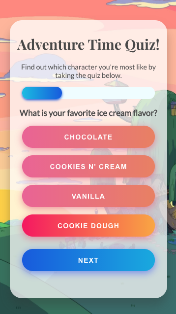

# Adventure Time Personality Quiz

<p align="center">
  <a href="https://github.com/sarahdepalo/adventure-time-backend"><strong>Check Out the Quiz API »</strong></a>
</p>

Buzzfeed style Adventure Time Quiz - find out which character you're most like at [placeholder link]()! 

This project was built to practice writing TypeScript without a tutorial. My goal was to recreate the quiz style tutorial I had followed previously, but to make it more a bit more complicated and involved (and fun). Instead of using a published API, I created one specifically for this quiz. 

Each character in the database is assigned a value and each answer is assigned up to three of those character values. When a use selects an answer those values are pushed into an array. An algorithm is used to determine the final character by selecting the most common value out of that array.

## Gif Walkthrough


## Mobile


## Stack
* PostgreSQL
* Express
* React
* Node.js
* TypeScript
* Scss

## Code Example 
This code was used on the backend for the questions route that can be viewed here: [adventure-time-quiz.herokuapp.com/questions](https://adventure-time-quiz.herokuapp.com/questions).
```javascript 
static async getAllQuestions() {
    try {
        const response = await db.any(`
        SELECT question, json_agg(json_build_object('answer', answers.answer, 'character_values', (json_build_array(answers.character_value, answers.character_value2, answers.character_value3)))) as answers
        FROM questions
        INNER JOIN answers on answers.question_id = questions.id
        GROUP BY question; `);
        return response;

```

## Goals

Having spent some time figuring out how to assign character values and determine a final character, I think it would be a fun goal to have users be able to create their own character quizzes and then share them on social media. 